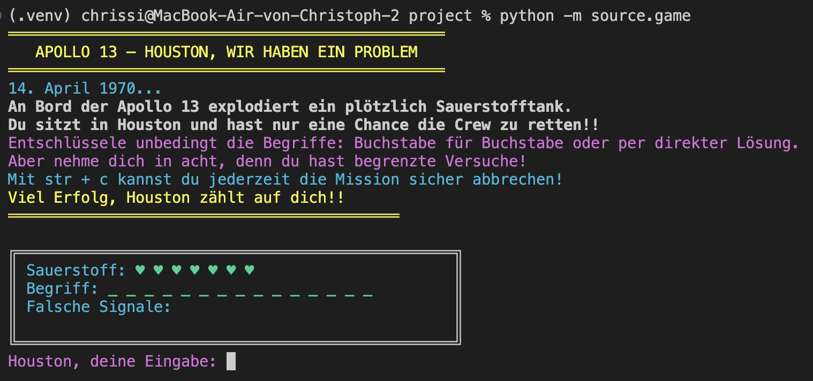
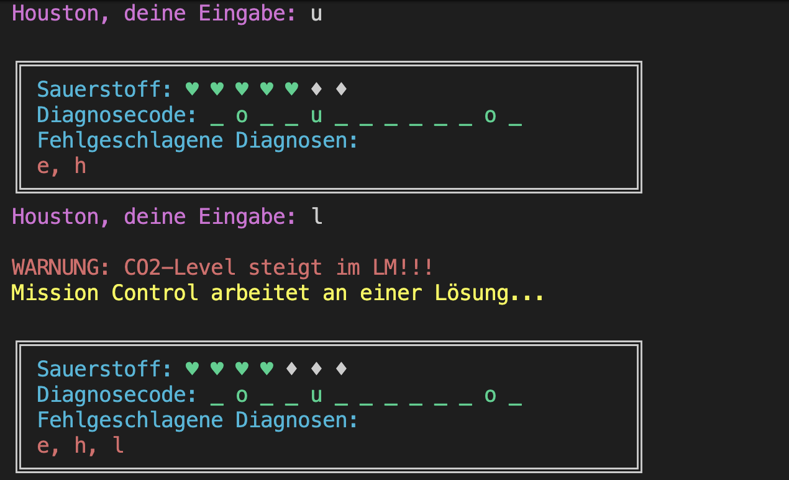
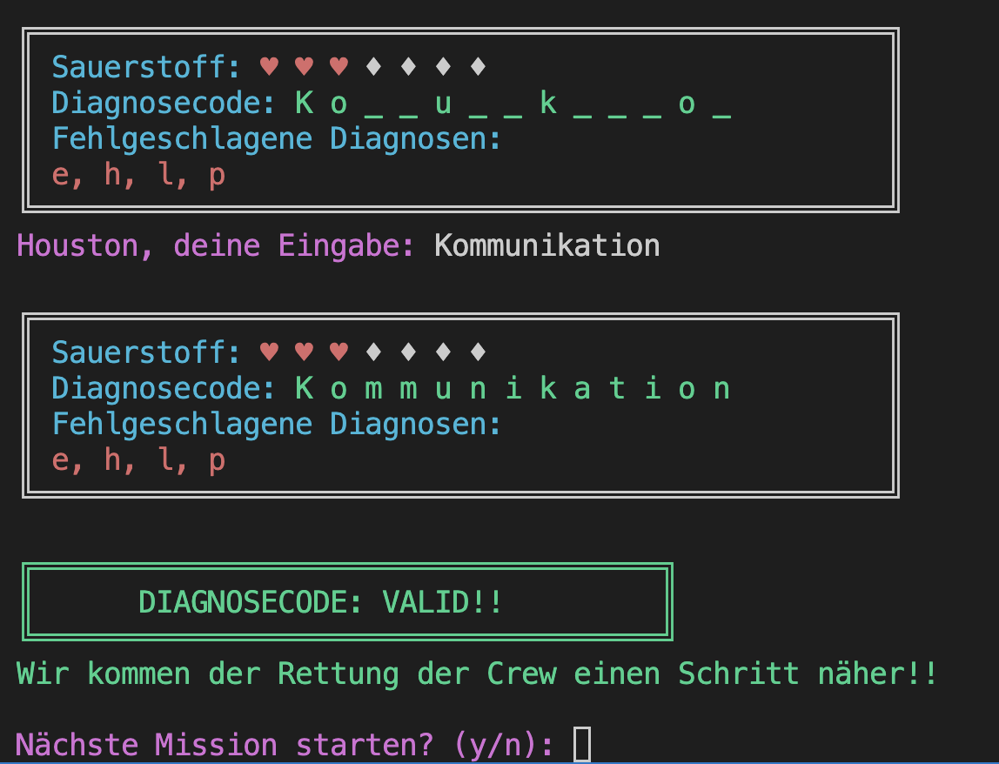
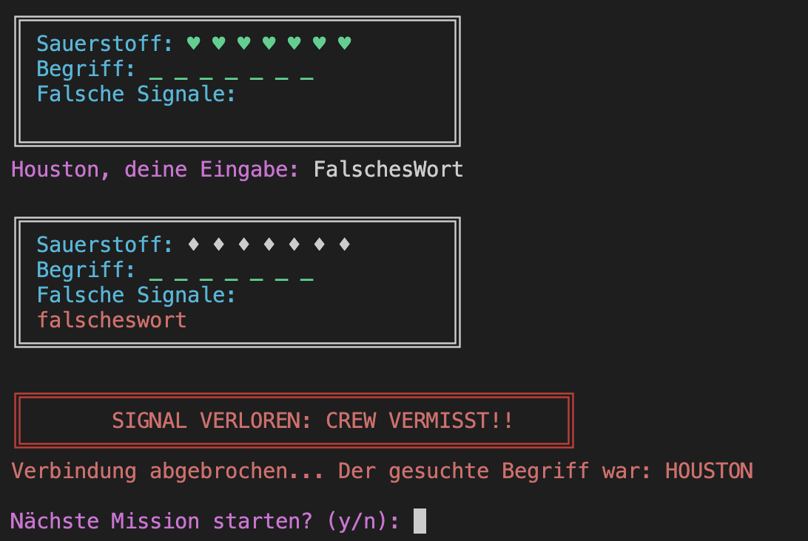
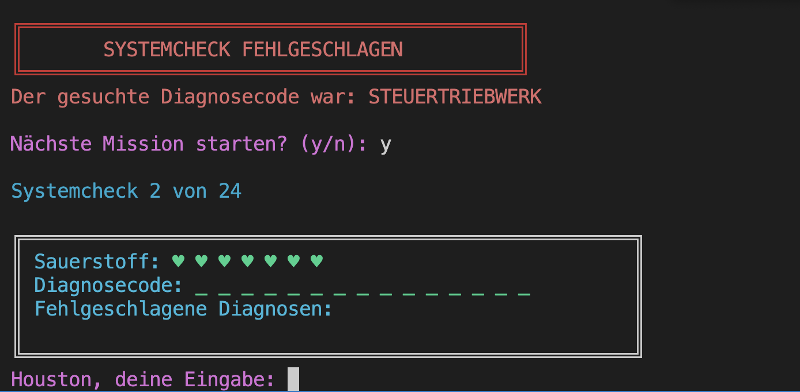

[](LICENSE)

# Houston We Have A Word

## Description
"Houston We Have A Word" is a command-line based word guessing game inspired by the classic Hangman.
Set in the dramatic events of the Apollo 13 mission in 1970, the player takes the seat at Mission Control in Houston. An oxygen tank has exploded on board and the player must bring the crew home safely by deciphering the hidden words related to space and aviation.

### Project Structure

```
project/
├── source/                             # contains the main game implementation and logic
│   ├── __init__.py
│   ├── game.py                         # main game loop, orchestrates the game flow
│   ├── display.py                      # handles all user interface and display logic 
│   ├── game_logic.py                   # contains the core game logic and state management
│   ├── word_loader.py                  # responsible for loading and managing word lists
│   └── wordrepo.txt                    # word repository used in the game
├── tests/                              # contains unit tests for the game
│   ├── .pylintrc                       # pylint configuration for tests folder
│   ├── __init__.py
│   ├── test_game.py
│   ├── test_display.py
│   ├── test_game_logic.py
│   ├── test_word_loader.py
│   ├── test_wordrepo.txt
│   ├── test_wordrepo_with_duplicates.txt
│   └── empty_wordrepo.txt
├── images/                             # contains all images used in the README and documentation
├── htmlcov/                            # contains coverage reports
├── documentation/                      # contains project documentation
├── mypy.ini                            # mypy configuration file
├── README.md
├── requirements.txt                    # list of project dependencies
└── LICENSE
```

## Requirements
- Python >= 3.10
- Optional: `mypy`, `pylint`, `coverage` for code analysis and testing

## Installation

```bash
# Cloning the repository and navigating into the project directory
git clone https://github.com/BitingRabbit/houston_we_have_a_word.git
cd project

# Creating a virtual environment
python -m venv .venv 

# Activating the virtual environment (Linux/MacOS)
source .venv/bin/activate

# Activating the virtual environment (Windows)
# Script execution is usually disabled on Win11, so:
Set-ExecutionPolicy Unrestricted -Scope CurrentUser
# then
my_env\Scripts\activate

# Installing all dependencies
pip install -r requirements.txt
```

## Usage

### Game Start
- make sure the `wordrepo.txt` file is located in the source  directory
- you need to start it from the root directory of the project, then execute the following command to start the game:
```bash
python -m source.game
```

### User Interface

- **game start:** the game will display a welcome message diving into the topic and the instructions/rules on how to play


- **user input:** one can either input a **single letter** or the **full word** as a guess

- **correct guess:** display will update and show the correctly guessed letters in the word
- **wrong guess:** display will show the wrongly guessed letters under "Fehlerhafte Diagnose" and update the health bar by removing one heart as shown above
- **having made a guess:** the user will be prompted to enter the next guess
- **game continues:** until the user has either guessed the full word correctly or has made 7 wrong guesses, which results in a loss

- **direct guess:** a user can guess directly the full word
- **if correct:** game is won

- **if wrong:** game is lost


- **after winning or losing:** the user will be prompted to play again or quit


## Testing and Code Analysis
To run the unit tests, make sure the following dependencies are installed:
- `coverage` 7.13.5
- `mypy` 1.19.1
- `pylint` 4.0.5

Then, you can run the tests using the following commands:
```bash
# unittests with coverage
coverage run -m unittest discover -s tests -t .
coverage report -m

# mypy type checking
mypy source tests

# pylint code analysis
pylint source tests

# pylint for test directory
cd tests
pylint .
```

### Metrics

| Metric | Value |
|--------|-------|
| Code Coverage | 86% |
| Mypy Warnings | 0 |
| Pylint Score | 10.0/10.0 |

## Documentation
For detailed documentation on the project please refer to the [documentation](./documentation/documentation.md) folder.

## Development & Contribution

Since the project is part of a university course, contributions are not expected. However, if you want to contribute or have suggestions for improvements, feel free to fork the project, make your changes and submit a pull request. Please ensure that your code adheres to the existing style and includes appropriate tests.


## License
This project is licensed under the **MIT License**. See the [LICENSE](LICENSE) file for details.