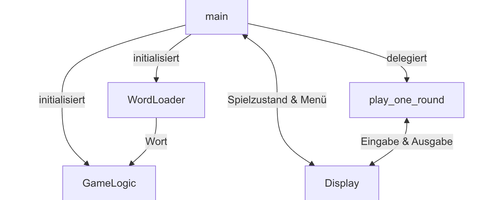
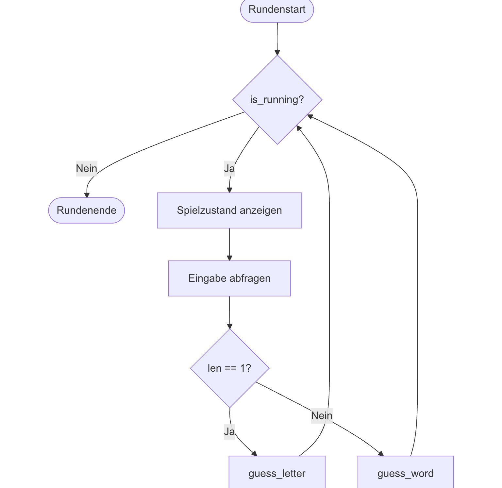
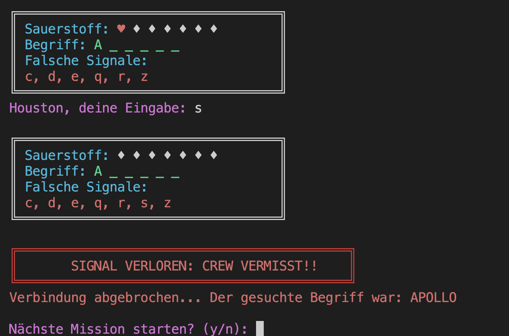
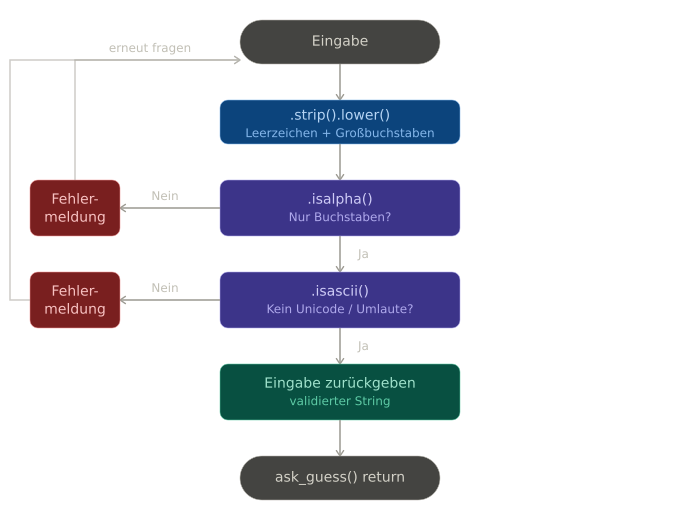
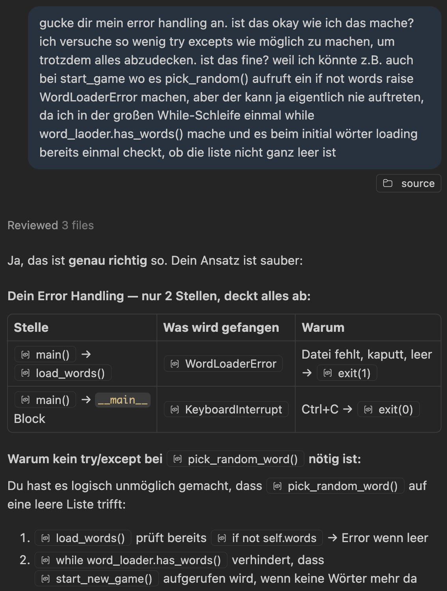

# Houston We Have A Word – Projektdokumentation

## **Inhaltsverzeichnis**

1. [Thematische Einleitung](#1-thematische-einleitung)
2. [Spielbeschreibung & Features](#2-spielbeschreibung--features)
3. [Architektur](#3-architektur)
- 3.1 [Projektstruktur](#31-projektstruktur)
- 3.2 [Konfigurationsdateien](#32-konfigurationsdateien)
- 3.3 [Modulübersicht](#33-modulübersicht)
- 3.4 [Zusammenspiel der Module](#34-zusammenspiel-der-module)
4. [Modulbeschreibungen](#4-modulbeschreibungen)
- 4.1 [word_loader.py - Datenladen und Wortmanagement](#41-word_loaderpy--datenladen-und-wortmanagement)
- 4.2 [game_logic.py - Kernlogik](#42-game_logicpy--kernlogik)
- 4.3 [display.py - Benutzeroberfläche](#43-displaypy--benutzeroberfläche)
- 4.4 [game.py - Orchestrator und Einstiegspunkt](#44-gamepy--orchestrator-und-einstiegspunkt)
5. [Programmablauf](#5-programmablauf)
- 5.1 [Gesamtablauf](#51-gesamtablauf)
- 5.2 [Rundenablauf - play_one_round](#52-rundenablauf--play_one_round)
- 5.3 [Fehlerbehandlung](#53-fehlerbehandlung)
6. [Benutzerinteraktion & Eingabevalidierung](#6-benutzerinteraktion--eingabevalidierung)
- 6.1 [Spielablauf aus Nutzersicht](#61-spielablauf-aus-nutzersicht)
- 6.2 [Eingaben und Validierung](#62-eingaben-und-validierung)
7. [Tests](#7-tests)
- 7.1 [test_word_loader.py](#71-test_word_loaderpy)
- 7.2 [test_game_logic.py](#72-test_game_logicpy)
- 7.3 [test_display.py](#73-test_displaypy)
- 7.4 [test_game.py](#74-test_gamepy)
- 7.5 [Testergebnisse & Coverage](#75-testergebnisse--coverage)
- 7.6 [Pylint](#76-pylint)
- 7.7 [MyPy](#77-mypy)
8. [Voraussetzungen/Installation](#8-voraussetzungeninstallation)
- 8.1 [Voraussetzungen](#81-voraussetzungen)
- 8.2 [Installation & Ausführung](#82-installation--ausführung)

9. [Hilfsmittel & Ressourcen](#9-hilfsmittel--ressourcen)
10. [Reflexion/Verbesserungen](#10-reflexionverbesserungen)

---

## 1. **Thematische Einleitung**

Am 13. April 1970 kam es während der Apollo-13-Mission zu einer Explosion eines Sauerstofftanks im Servicemodul, die eine der schwersten Krisen in der Geschichte der Raumfahrt auslöste. Die Astronauten Jim Lovell, Jack Swigert und Fred Haise befanden sich auf dem Weg zum Mond, als das Missionskontrollzentrum in Houston innerhalb kürzester Zeit Maßnahmen entwickeln musste, um ihre sichere Rückkehr zu ermöglichen.

*Houston We Have A Word* greift diese Situation thematisch auf und überträgt sie in ein Wortratespiel, bei dem der Spieler die Rolle des Kontrollzentrums übernimmt. Ziel ist es, versteckte Begriffe ("Diagnosecodes") aus dem Bereich der Raumfahrt zu entschlüsseln, wobei bei jedem falschen Versuch der CO2-Level im Lunar Module (LM) steigt.

---

## 2. **Spielbeschreibung & Regeln**

- angelehnt an das klassische Hangman
- jegliche **Eingaben** geschehen über das **Terminal**
- die *Diagnosecodes* können **buchstabenweise** oder als **vollständiges Wort** geraten werden
- **6 Fehler** pro Runde erlaubt, visualisiert als farbige Sauerstoff-Anzeige (Health-Bar), **7. Fehler** führt zu einer sofortigen **Niederlage**
- **falscher Direktversuch** führt ebenfalls sofort zu einer Niederlage
- **Farbwechsel der Anzeige** bei kritisch niedrigem Sauerstoffstand (≤ 3 Versuche: rot)
- falsch geratene Buchstaben werden **sortiert und angezeigt**
- **Systemcheck-Anzeige** zeigt den Fortschritt durch die Wortliste
- Wörter werden **zufällig ausgewählt und nach Verwendung entfernt**, d.h. keine Wiederholungen innerhalb einer Session
- **Farbige Konsolenausgabe** für bessere Lesbarkeit
- **sicherer Programmabruch** bei `Ctrl+C` an jeder Stelle im Programm
- nach jeder Runde (Systemcheck) kann der Spieler entscheiden, ob er **weiterspielen** oder das Spiel **beenden** möchte

---

<div style="page-break-after: always"></div>

## **3. Architektur**

### **3.1 Projektstruktur**

```
project/
├── source/
│   ├── __init__.py
│   ├── game.py
│   ├── display.py
│   ├── game_logic.py
│   ├── word_loader.py
│   └── wordrepo.txt
├── tests/
│   ├── .pylintrc
│   ├── __init__.py
│   ├── test_game.py
│   ├── test_display.py
│   ├── test_game_logic.py
│   ├── test_word_loader.py
│   ├── test_wordrepo.txt
│   ├── test_wordrepo_with_duplicates.txt
│   └── empty_wordrepo.txt
├── mypy.ini
├── README.md
├── requirements.txt
└── LICENSE
```

### **3.2 Konfigurationsdateien**

**`mypy.ini`**: Konfigurationsdatei für den statischen Typchecker MyPy

**`requirements.txt`**: vollständige Liste aller installierten Pakete der Entwicklungsumgebung mit exakten Versionsnummer

### **3.3 Modulübersicht**

Das Projekt folgt einer klaren **Separation of Concerns**: Jedes Modul hat genau eine Verantwortlichkeit:

| Modul            | Verantwortlichkeit                                                                 |
|------------------|------------------------------------------------------------------------------------|
| `game.py`        | Einstiegspunkt und Orchestrator -> koordiniert alle anderen Module                  |
| `display.py`     | gesamte Ein- und Ausgabelogik (UI-Schicht)                                         |
| `game_logic.py`  | Kernlogik: Ratemethoden, Zustandsverwaltung, Gewinn-/Verlustprüfung            |
| `word_loader.py` | Datei-I/O: Laden, Validieren und zufälliges Auswählen von Wörtern     |

### **3.4 Zusammenspiel der Module**
 `game.py` ist der zentrale Orchestrator und der einzige Berührungspunkt zwischen den übrigen Modulen. `GameLogic` und `WordLoader` kommunizieren **ausschließlich** über `game.py`. `Display` hat keinerlei Kenntnis von der Spiellogik und arbeitet nur mit den Werten, die ihm von `game.py` übergeben werden.



---

## **4. Modulbeschreibungen**

### **4.1 `word_loader.py` - Datenladen und Wörter verwalten**

Dieses Modul kapselt den gesamten Dateizugriff und das Pre-Processing der Wortliste. Es definiert zwei Klassen: die **selbst definierte Exception** `WordLoaderError` und die Hauptklasse `WordLoader`.

#### `WordLoaderError`

 Diese eigene Exception dient dazu, dass man alle datei- und wortlistenbezogenen Fehler klar dem Urpsrung (word_loader) zuordnen und von allgemeinen Python-Ausnahmen unterscheiden kann.

#### `WordLoader.__init__(filename: str)`

Der Konstruktor liest die Wortdatei ein und wendet beim Laden direkt mehrere **Validierungen** an. Ein Wort wird nur aufgenommen, wenn es:
- ausschließlich alphabetische Zeichen enthält (`isalpha()`)
- ausschließlich ASCII-Zeichen enthält (`isascii()`). Umlaute werden ausgeschlossen, da auch die Eingabevalidierung nur ASCII akzeptiert
- zwischen 5 und 29 Zeichen lang ist (Mindestlänge für sinnvolle Spielbarkeit, Maximallänge für die Darstellung)
- noch nicht in der Liste vorhanden ist (**Erkennung von Duplikaten**)

Wird die Datei nicht gefunden oder enthält nach der Filterung keine gültigen Wörter, wird ein `WordLoaderError` geworfen. Nach erfolgreichem Laden wird `loaded_words` als unveränderlicher Zähler gesetzt, welcher später dem Missionsanzeiger in `Display` dient.

**Generell:** Alle Fehler, die während des Ladens auftreten, werden auf dieser Ebene als `WordLoaderError` gekapselt und danach in `game.py` behandelt. Andere Module, die `WordLoader` verwenden, müssen sich nicht mit diesen Fehlern auseinandersetzen. Einmal erfolgreich geladen, können keine weiteren Fehler mehr auftreten bzgl. des WordLoaders.

#### `has_words() -> bool`

Gibt `True` zurück, solange die Wortliste nicht leer ist. Wird von der Hauptschleife in `game.py` als Abbruchbedingung verwendet.

#### `pick_random_word() -> str`

Wählt mittels `random.choice()` ein zufälliges Wort aus der Liste und **entfernt es anschließend sofort** mit `list.remove()`. Das sofortige Entfernen ist eine bewusste Designentscheidung: Die Liste verkleinert sich mit jeder Runde, was Wiederholungen innerhalb einer Session unmöglich macht, ohne dass eine separate „bereits verwendet"-Methode benötigt wird. Die Methode gibt das gezogene Wort zurück. Da die Hauptschleife in `game.py` durch `while word_loader.has_words()` abgesichert ist, kann hier davon ausgegangen werden, dass die Liste nicht leer ist, ein `IndexError` wird somit ausgeschlossen, ohne dass ein separater try-except-Block nötig wäre.

---

### **4.2 `game_logic.py` - Kernlogik**

Diese Klasse ist der Kern des Spiels. Sie verwaltet den gesamten Spielzustand und stellt ausschließlich Methoden bereit, die für den Spielablauf notwendig sind.

#### Designentscheidung: `wrong_guesses` als `set`

Falsch geratene Buchstaben und Wörter werden in einem **`set`** gespeichert, nicht in einer `list`. Dies hat den Vorteil, dass derselbe falsche Buchstabe nicht mehrfach eingetragen wird, denn ein `set` erlaubt keine Duplikate. Damit wird auch sichergestellt, dass ein bereits als falsch erkannter Buchstabe keine weiteren Versuche kostet, ohne dass eine explizite Methode mit Prüfung auf Duplikate nötig wäre. Zudem werden somit auch in Display keine Duplikate angezeigt.

#### `MAX_ATTEMPTS`
`MAX_ATTEMPTS` wurde als Klassenkonstante definiert, da sie allgemeingültig ist und laut Spielregeln so definiert ist. 

#### `start_new_game() -> None`

Setzt den Spielzustand vollständig zurück: ruft `pick_random_word()` des `WordLoader` auf und leert alle Zustandsvariablen. Trennt klar die Initialisierung einer einzelnen Runde von der Gesamtinitialisierung des Spiels.

#### `guess_letter(letter: str) -> None`

Verarbeitet einen einzelnen Buchstaben. Der Buchstabe wird zunächst in `guessed_letters` aufgenommen (unabhängig von Korrektheit), wenn er noch nicht geraten wurde. Nur wenn der Buchstabe **weder im gesuchten Wort noch bereits in `wrong_guesses`** enthalten ist, wird er als Fehler gewertet: Er wird zu `wrong_guesses` hinzugefügt und `attempts_left` wird dekrementiert. Diese doppelte Bedingung verhindert, dass für den gleichen Fehler mehrfach Herzen abgezogen werden.

#### `guess_word(word: str) -> None`

Verarbeitet einen Direktversuch. Bei korrekter Eingabe werden **alle Buchstaben des Wortes** via `set.update()` in `guessed_letters` aufgenommen, was in `is_won()` sofort `True` ergibt. Bei falscher Eingabe wird `attempts_left` sofort auf `0` gesetzt, welches in `is_running()` sofort `False` ergibt. Durch diese Designentscheidung, dass also bei einem Direktversuch die Buchstaben hinzugefügt werden oder der Counter auf 0 gesetzt wird, kann die Logik in `is_won()` und `is_running()` sehr einfach gehalten werden, ohne dass dort spezielle Fälle für Direktversuche berücksichtigt werden müssen. Dies war nämlich anfangs ein Punkt, wo ich mir schwer getan habe, die Logik so zu gestalten, dass sie alle Fälle korrekt abdeckt, ohne dass es zu unübersichtlich wird.

#### `is_won() -> bool`

Prüft mit der `all()`-Funktion, ob jeder Buchstabe des gesuchten Wortes in `guessed_letters` enthalten ist. Dies ermöglicht eine kompakte, pythonische Prüfung.

#### `is_running() -> bool`

Fasst die Abbruchbedingungen einer Spielrunde zusammen: Das Spiel läuft solange, wie es **noch nicht gewonnen** ist und **noch Versuche verbleiben**. Diese wird in `play_one_round()` als Bedingung der `while-Schleife` verwendet und ist durch die Verwendung von `is_won()` und `attempts_left` sehr kompakt gestalltet.

#### `get_display_word() -> str`

Returned die Anzeige des gesuchten Wortes für `Display`. Somit braucht Display keine Kenntnis von `guessed_letters` oder dem aktuellen Wort haben. Damit bleibt die Trennung zwischen Logik und Darstellung gewahrt.

---

### **4.3 `display.py` - User Interface**

Alle Konsolenausgaben und Benutzereingaben sind in der Klasse `Display` als **statische Methoden** (`@staticmethod`) gebündelt. Da `Display` keinen Zustand hält und alle Methoden unabhängig voneinander aufgerufen werden können, sind Instanzmethoden nicht notwendig. Dies ist eine bewusste Entscheidung. Alle Methoden sind so gestaltet, dass sie nur die Informationen erhalten, die sie für ihre Ausgabe benötigen, ohne dass sie selbst Logik oder Zustand verwalten müssen. Dadurch bleibt `Display` eine reine Präsentationsschicht.

#### `ask_guess() -> str`

Implementiert eine **Eingabeschleife** (`while True`), die so lange wiederholt wird, bis eine gültige Eingabe vorliegt. Eine Eingabe gilt als gültig, wenn sie nach `strip()` und `lower()` die Bedingungen `isalpha()` (nur Buchstaben) und `isascii()` (kein Unicode/Umlaute) erfüllt. Die Methode gibt immer einen bereinigten, kleingeschriebenen String zurück. Somit muss sich die aufrufende Seite um keine Normalisierung kümmern. Zudem sind die Validierungen hier und im WordLoader identisch, was sicherstellt, dass der Spieler keine Wörter erraten kann, die unmöglich zu erraten sind.

#### `show_current_state(display_word, wrong_guesses, attempts_left, max_attempts) -> None`

Rendert die **Spielanzeige**. Die Health-Bar wird dynamisch aus Herzzeichen zusammengesetzt: ab ≤ 3 verbleibenden Versuchen wechselt die Farbe von Grün auf Rot. Die Breite des Rahmens passt sich dynamisch der Wortlänge an. Falsch geratene Buchstaben werden via `sorted()` alphabetisch sortiert ausgegeben.

#### `show_game_over_message(won, correct_word) -> None`

Gibt je nach Spielausgang eine kontextuell passende Abschlussmeldung aus. Im Verlustfall wird das gesuchte Wort in Großbuchstaben angezeigt. Auch hier wird mit `won` auf die `is_won()` Methode aus `game_logic` zurückgegriffen.

#### `quit_continue_menu() -> bool`

Implementiert ebenfalls eine Eingabeschleife und gibt `True` (weiterspielen) oder `False` (beenden) zurück. Die  Rückgabe als bool ermöglicht es `game.py`, die Entscheidung direkt als Bedingung zu verwenden: `if not Display.quit_continue_menu(): sys.exit(0)`.

---

### **4.4 `game.py` - Orchestrator und Einstiegspunkt**

Dieses Modul koordiniert das Spiel, enthält aber selbst keine Geschäftslogik und ist bewusst schlank gehalten, damit der Spielablauf stets übersichtlich bleibt. 

#### `main() -> None`

Initialisiert die zwei zentralen Objekte (`WordLoader`, `GameLogic`) und startet die Hauptspielschleife. Da `Display` keinen Zustand hält, kann es direkt verwendet werden und muss nicht instanziiert werden. Der `try/except`-Block um den `WordLoader`-Aufruf ist der **einzige Fehlerbehandlungspunkt** für Dateiprobleme im gesamten Programm. Wenn erfolgreich, kann der Spielablauf ohne weitere Fehlerbehandlungen bzgl. des WordLoaders fortgesetzt werden. Die Schleife `while word_loader.has_words()` läuft solange, bis alle Wörter verbraucht sind oder der Spieler explizit beendet.

#### `play_one_round(game_logic: GameLogic) -> None`

Kapselt den Ablauf einer einzelnen Runde in einer eigenen Funktion. Die Funktion fragt in einer Schleife Eingaben ab, bis `game_logic.is_running()` `False` zurückgibt, und leitet die Eingabe basierend auf ihrer Länge (`len(guess) == 1`) an die korrekte Methode aus `GameLogic` weiter. Die Implementation in eine eigene Funktion dient der Übersichtlichkeit.

#### `if __name__ == "__main__"`

Der `KeyboardInterrupt`-Handler auf der obersten Ausführungsebene fängt `Ctrl+C` jederzeit ab und sorgt für eine kontrollierte Beendigung mit `sys.exit(0)`. Somit hat der Spieler die Möglichkeit, das Spiel jederzeit sicher zu verlassen, ohne dass es zu einem unkontrollierten Absturz oder einem Traceback kommt.

---

## **5. Programmablauf**

### **5.1 Gesamtablauf**


<div style="page-break-after: always"></div>

### **5.2 Rundenablauf – `play_one_round`**



<div style="page-break-after: always"></div>

### **5.3 Fehlerbehandlung**

| Fehlerfall                    | Auslöser                        | Verhalten                          |
|-------------------------------|----------------------------------|------------------------------------|
| Wordrepo nicht gefunden      | `FileNotFoundError` im Konstruktor | `WordLoaderError` -> `sys.exit(1)` |
| Wortdatei leer / keine gültigen Wörter | Leere Liste nach Filterung | `WordLoaderError` -> `sys.exit(1)` |
| Ungültige Benutzereingabe     | `isalpha()` / `isascii()` schlägt fehl | Erneute Eingabeaufforderung |
| `KeyboardInterrupt`           | `Ctrl+C` auf Ebene `__main__`   | Abschlussmeldung + `sys.exit(0)`  |

### **Grundprinzip der Fehlerbehandlung:**
---
 >Es wird auf eine doppelte, mehrfache Fehlerbehandlung verzichtet. Stattdessen wurde das Programm so designed, dass es auf der untersten Ebene immer die Fehler abfängt, dort am besten behandelt, sodass andere Module, die diese Funktionalität nutzen, selbst keine Fehlerbehandlung mehr brauchen. Somit mussten nicht viele try-except Blöcke verwendet werden. Durch die klare Trennung der Verantwortlichkeiten der Module und ordentliche Validierung und Normalisierung sowie Abbruchbedingungen wird trotzdem sichergestellt, dass es zu keinen unbehandelten Fehlern kommt und alles abgedeckt ist.

**Beispiele:**
- Benutzereingaben werden direkt validiert, normalisiert und ggf. erneut abgefragt, sodass weitere Spiellogiken den Rückgabewert direkt nutzen können.
- durch `while word_loader.has_words()` in `main()`wird sichergestellt, dass es zu keinem IndexError kommt, wenn `pick_random_word()`aufgerufen wird.
- die WordLoader-Fehler werden auf der untersten Ebene abgefangen und als `WordLoaderError` neu geworfen, sodass sie in `game.py` mit einem einzigen try-except-Block behandelt werden können.

<div style="page-break-after: always"></div>

## **6. Benutzerinteraktion & Eingabevalidierung**

### **6.1 Spielablauf aus Nutzersicht**

**Spielstart - Willkommensnachricht:**

> 

---

**Laufende Runde - Spielzustand mit Sauerstoff-Bar, verstecktem Wort und falschen Buchstaben:**
- Eingabe von einzelnen korrekten und falschen Buchstaben
- falsche Buchstaben in *fehlgeschlagene Diagnosen* angezeigt

> 

<div style="page-break-after: always"></div>

**Direktes Erraten des Wortes + Gewinnnachricht:**
> 

---

**Direktes Erraten des Wortes + Verloren-Nachricht:**

> 

<div style="page-break-after: always"></div>

**zu viele falsche Versuche**
> ---
> 
> ---

**Runde vorbei: Erneutes Spielen + Systemcheck-Anzeige:**

> ---
> 
> ---

<div style="page-break-after: always"></div>

### **6.2 Eingaben und Validierung**

| Eingabe         | Erwartetes Format
|-----------------|----------------------------
| Buchstabe raten | Einzelner ASCII-Buchstabe
| Wort raten      | Mehrere ASCII-Buchstaben
| Menüauswahl     | `y` oder `n`

### Validierungslogik in `ask_guess()`

> 

---

<div style="page-break-after: always"></div>

## **7. Tests**

Das Projekt verwendet das Python-Standardmodul `unittest` in Kombination mit `unittest.mock` für `patch`.

**Tests ausführen (aus dem project-root):**
```bash
python -m unittest discover -s tests -t .
coverage report -m
```

---

### **7.1 `test_word_loader.py`**

#### **`test_load_words_success_and_has_words_true`**
Lädt eine gültige Testdatei und prüft, ob anschließend `has_words()` `True` zurückgibt.

#### **`test_load_words_file_not_found`**
Stellt sicher, dass eine fehlende Datei einen `WordLoaderError` auslöst.

#### **`test_load_words_empty_file`**
Prüft, dass eine leere Datei einen `WordLoaderError` auslöst. Deckt den Fall ab, dass die Datei zwar existiert, aber keine spielbaren Wörter enthält.

#### **`test_load_words_duplicate_words`**
Prüft die Duplikaterkennung: Eine Testdatei mit zwei gleichen Wörtern darf nach dem Laden nur einmal das Wort in der Liste enthalten.

#### **`test_has_words_false`**
Prüft, dass `has_words()` nach dem Entnehmen aller Wörter durch wiederholtes `pick_random_word()` `False` zurückgibt. Testet somit das Zusammenspiel beider Methoden.

#### **`test_pick_random_word`**
Prüft, dass das zurückgegebene Wort aus der bekannten Menge an Testwörtern stammt und anschließend **nicht mehr** in der Liste vorhanden ist. Zeigt somit das korrekte Entfernen der Wörter nach dem Ziehen.

#### **`test_words_filter_correct`**
Prüft, dass alle geladenen Wörter die Validierungskriterien erfüllen (`isalpha()`, `isascii()`, Länge zwischen 5 und 29 Zeichen) und dass die korrekte Anzahl an Wörtern geladen wurde.

---

### **7.2 `test_game_logic.py`**

Der `setUp()`-Hook initialisiert vor jedem Test eine `GameLogic`-Instanz mit einem minimalen `TestWordLoader`, der immer das Wort `"test"` zurückgibt. Dies vermeidet Abhängigkeiten von anderen Modulen und macht die Tests  deterministisch.

#### **`test_guess_letter_correct`**
Prüft den Positivfall: richtige Buchstaben werden in `guessed_letters` aufgenommen, kein Eintrag in `wrong_guesses`, kein Abzug der Herzen und Spiel läuft normal weiter.

#### **`test_guess_letter_incorrect`**
Prüft den Negativfall: falsche Buchstaben werden in `wrong_guesses` **und** in `guessed_letters` aufgenommen, `attempts_left` wird um 1 dekrementiert, das Spiel läuft noch.

#### **`test_guess_duplicate_correct_letter`**
Derselbe richtige Buchstabe zweimal geraten darf in `guessed_letters` nicht doppelt vorkommen und kostet keine Versuche.

#### **`test_guess_duplicate_wrong_letter`**
 Derselbe falsche Buchstabe darf nur einmal in `wrong_guesses` stehen und `attempts_left` nur einmal dekrementieren.

#### **`test_guess_word_correct`**
Prüft alle Folgen eines korrekten Direktversuchs: `is_won()` ist `True`, `is_running()` ist `False`, keine Versuche wurden abgezogen, alle Buchstaben des Wortes sind in `guessed_letters`. Grund: allgemeine Spielregeln.

#### **`test_guess_word_incorrect`**
Prüft alle Folgen eines falschen Direktversuches: Das Wort landet in `wrong_guesses`, `attempts_left` ist `0`, `is_won()` ist `False`, `is_running()` ist `False`. Testet somit das sofortige Beenden einer Runde (Systemcheck) bei Falschlösung.

#### **`test_get_display_word` / `test_get_display_word_no_guesses`**
Prüft die korrekte Darstellung des teilweise und vollständig unbekannten Wortes. Testet dabei auch das `.capitalize()`-Verhalten, das den ersten Buchstaben des Anzeigewortes großschreibt.

#### **`test_is_won_letters`**
Prüft, dass das Raten aller Buchstaben des Zielwortes `is_won()` auf `True` setzt.

#### **`test_is_won_false_and_lost_letters`**
Kombinierter Test: Zunächst wird geprüft, dass ein einzelner richtiger Buchstabe noch nicht zum Sieg führt. Dann werden so viele falsche Buchstaben geraten, bis alle Versuche aufgebraucht sind, weswegen danach `is_won()` `False` und `is_running()` `False` ist. Testet das Szenario bei einem verlorenen Spiel durch falsches Einzel-Raten vollständig.

#### **`test_is_running_wrong_word`**
Prüft den Spielzustand in Sequenz: läuft -> ein richtiger Buchstabe, läuft noch -> falsches Wort, läuft nicht mehr. Testet die Interaktion von `is_running()` mit `guess_word()`.

#### **`test_start_new_game`**
Prüft, dass nach einem Aufruf von `start_new_game()` alle Zustandsvariablen vollständig zurückgesetzt wurden: neues Wort, maximale Versuche, leere Sets. Testet somit die vollständige Neu-Initialisierung einer Runde.

---

### **7.3 `test_display.py`**

#### **`test_ask_guess`**
**Prüft zwei Szenarien:**
- 1. Groß-/Kleinschreibung wird normalisiert und Whitespace entfernt 
- 2. Ungültige Eingaben (Zahlen, Sonderzeichen) werden nicht returned: durch die While-Schleife wird so lange weiter gefragt, bis eine gültige Eingabe kommt.

#### **`test_quit_continue_menu`**
**Prüft alle drei relevanten Eingabepfade: **
- 1. `y` -> `True`
- 2. `n` -> `False`
- 3. ungültige Eingabe gefolgt von `y` -> `True`. 
Stellt sicher, dass die While-Schleife korrekt arbeitet und der boolesche Rückgabewert stimmt.

#### **`test_show_current_state_displays_word`**
Prüft, dass das übergebene `display_word` und die `wrong_guesses` tatsächlich in der Ausgabe erscheinen. `builtins.print` wird gemockt und alle Ausgaben werden zu einem String zusammengefasst, in dem dann gesucht wird. Stellt sicher, dass keine der wichtigen, übergebenen Informationen in der Darstellung fehlen.

#### **`test_show_systemcheck_counter`**
Prüft die Berechnung der aktuellen Systemcheck-Runde: Bei 2 verbleibenden Wörtern von 5 Gesamtwörtern muss der Ausgabe-String die Zahlen `"3"` und `"5"` enthalten. Testet somit die Berechnung.

---

### **7.4 `test_game.py`**

Alle Tests in dieser Klasse mocken `WordLoader`, `GameLogic` und `Display` vollständig, da hier die **Orchestrierungslogik** von `game.py` getestet wird und nicht die einzelnen Komponenten.

#### **`test_single_letter_calls_guess_letter`**
Prüft, dass bei einer Eingabe von einem Buchstaben `game_logic.guess_letter()` aufgerufen wird und `guess_word()` **nicht**. Testet die `len(guess) == 1`-Verzweigung in `play_one_round()`. `is_running.side_effect = [True, False]` steuert genau eine Schleifeniteration.

#### **`test_full_word_calls_guess_word`**
Gegenstück zum vorherigen Test: Eingabe mit mehreren Buchstaben muss `guess_word()` auslösen und `guess_letter()` **nicht**.

#### **`test_main_word_loader_error_exits`**
Prüft, dass ein `WordLoaderError` beim Initialisieren des `WordLoader` zu `sys.exit(1)` führt. `WordLoader` wird so gemockt, dass er beim Aufruf sofort den Error wirft. `assertRaises(SystemExit)` fängt den Exit ab und ermöglicht dann die Prüfung des Exit-Codes.

#### **`test_main_player_quits_after_one_round`**
Prüft den Exit-Pfad nach einer Runde: `has_words` gibt erst `True`, dann `False` zurück (eine Schleifeniteration). `quit_continue_menu` gibt `False` zurück (Spieler beendet). Erwartet `sys.exit(0)`.

#### **`test_main_runs_full_loop_then_no_words`**
 Eine Runde wird gespielt, der Spieler möchte weiterspielen (`quit_continue_menu` -> `True`), aber `has_words` gibt danach `False` zurück. Die Schleife endet ohne `sys.exit()`.

---

### **7.5 Testergebnisse & Coverage**

| Modul                    | Statements | Missed | Coverage |
|--------------------------|------------|--------|----------|
| `source/display.py`      | 69         | 17      | 75%     |
| `source/game.py`         | 36         | 5      | 86%     |
| `source/game_logic.py`   | 31         | 0      | 100%    |
| `source/word_loader.py`  | 22         | 0      | 100%    |
| **Gesamt**               | **158**    | **22** | **86%** |

**vollständiger Coverage-Report** unter
`htmlcov/index.html`

### **Bewusst nicht getestete Bereiche**

| Bereich                          | Begründung                                                                                    |
|----------------------------------|-----------------------------------------------------------------------------------------------|
| `Display.show_welcome_message()` | Reine Textausgabe ohne Verzweigungen oder Rückgabewerte  |
| `Color`-Klasse                   | Ausschließlich Definitionen von Konstanten               |

### **7.6 Pylint**

#### **Source/ Folder**

> Ausführen mit: `pylint source/`
> ```
> (.venv) chrissi@MacBook-Air-von-Christoph-2 project % pylint source/
> --------------------------------------------------------------------
> Your code has been rated at 10.00/10 (previous run: 10.00/10, +0.00)
> ```

#### **Tests/ Folder**

> Zuerst in den Test Folder gehen, da dort eine separate `.pylintrc` mit angepassten Regeln liegt. Dann ausführen mit: `pylint .`
> ```
> (.venv) chrissi@MacBook-Air-von-Christoph-2 tests % pylint .
> --------------------------------------------------------------------
> Your code has been rated at 10.00/10 (previous run: 10.00/10, +0.00)
> ```

- hier wurden lediglich gemäß der Projektregeln die `missing-module-docstring` und `missing-function-docstring` ignoriert. Class-Docstrings sind immer vorhanden, function-docstrings nur dort, wo der Name der Funktion nicht selbsterklärend ist oder zustätzliche Informationen zum Verständnis der Test-Funktion nützlich sind.

### **7.7 MyPy**

> Ausführen mit: `mypy source/`
> ```
> (.venv) chrissi@MacBook-Air-von-Christoph-2 project % mypy source 
> Success: no issues found in 5 source files
> ```

<div style="page-break-after: always"></div>

## **8. Voraussetzungen/Installation**

### **8.1 Voraussetzungen**

| Komponente | Version  |
|------------|----------|
| Python     | >=3.10    |
| coverage   | 7.13.5   |
| mypy       | 1.19.1   |
| pylint     | 4.0.5   |

### **8.2 Installation & Ausführung**

```bash
# Repository klonen und in das Projektverzeichnis wechseln
git clone https://github.com/BitingRabbit/houston_we_have_a_word.git
cd project

# Virtuelle Umgebung erstellen
python -m venv .venv 

# Aktivieren der virtuellen Umgebung (Linux/MacOS)
source .venv/bin/activate

# Aktivieren der virtuellen Umgebung (Windows)
# Die Ausführung von Skripts ist auf Win11 meist deaktiviert, daher:
Set-ExecutionPolicy Unrestricted -Scope CurrentUser
# dann erst
my_env\Scripts\activate

# Alle Abhängigkeiten installieren
pip install -r requirements.txt

# Spiel starten aus dem project-root Verzeichnis
python -m source.game

# Tests ausführen
python -m unittest discover -s tests -t .
coverage report -m

# mypy- und pylint-Checks
mypy source/
pylint source/

# für pylint in Test-Ordner:
cd tests
pylint .
```

<div style="page-break-after: always"></div>

## **9. Hilfsmittel & Ressourcen**

Die `Color`-Klasse in `display.py` wurde entnommen von:
https://stackoverflow.com/questions/8924173/how-can-i-print-bold-text-in-python

Für die README.md wurde Inspiration an folgender README.md aus folgendem Repo genommen:
https://github.com/JuliusWiedemann/PythonCIExample/blob/main/README.md

**Claude Opus 4.6 wurde für folgende Zwecke genutzt:**

- Dass die Imports mit einem . vorangestellt werden, um relative Imports zu ermöglichen, wurde durch Claude gelernt.

- Einzelne Abbildungen in der Dokumentation (Ordner-Struktur, Mermaid) wurden mithilfe von Claude erstellt, da dieser einem schnell gewisse Symbole/Zeichen geben kann.

- Ideen, zum Beispiel die Verwendung von `MagicMock()` oder gewisse Funktionen wie `calls_args_list`, `calls_args` wurden durch Claude angeregt, welche danach dann in der offiziellen Dokumentation von `unittest.mock` nachgelesen und verstanden wurden: https://docs.python.org/3/library/unittest.mock.html
https://docs.python.org/3/library/unittest.html#unittest.TestCase.assertRaises

  KI hat eben den Vorteil, dass man schnell über gewisse Konzepte oder Funktionen erfahren kann. Nachgelesen und verstanden werden muss es aber trotzdem

- In `test_game.py` wurde der Test `test_main_runs_full_loop_then_no_words` mithilfe von Claude erstellt, da ich hier meine Schwierigkeiten hatte sowie einen fehlenden Ansatz, wie ich einen ganzen Durchlauf simulieren könnte. Claude hat mir dann die Idee gegeben, dass ich `has_words` so steuern könnte, dass es erst `True` und dann `False` zurückgibt, um genau eine Schleifeniteration zu simulieren. Das war der entscheidende Ansatzpunkt, um diesen Test überhaupt erst schreiben zu können. Danach musste ich es nur noch in Code umsetzen, was dann auch relativ schnell ging.

- In `display.py` die Funktion `show_current_state`:
Hier wurde soweit alles selber implementiert. Anfangs gab es jedoch Probleme mit dem Spacing und der korrekten Größe des Rahmens. Nach vielem Herumspielen und adjustieren von Zahlen (deswegen teilweise die random Werte) wurde das letzte Problem, der Rand in der Zeile der Healthbar, durch Claude gefixed. 

Beim Code-Review durch Claude kamen zudem folgende Empfehlung:
- in `game.py` `while game_logic.is_running()` in eine seperate `play_one_round()` Funktion auszulagern
- `MAX_ATTEMPTS` als Klassenkonstante in `GameLogic` zu definieren

*Beispielhaft wurde KI folgendermaßen genutzt:*
- Eigenen Ansatz/Ideen darlegen und um Feedback bitten

> 
(Meinen Ausdruck ignorieren wir mal lieber :D)

<div style="page-break-after: always"></div>

## **10. Reflexion/Verbesserungen**

### **10.1 Positiv:**
Zufrieden bin ich insbesondere mit allen meiner Designentschedungen. Somit finde ich, dass ich es geschafft habe, das Spiel in seiner Logik so minimal/schlank wie möglich zu halten, und trotzdem alle Funktionalitäten sowie Sicherheitsvorkehrungen abzudecken. Hierbei sind die Module zwar von einander getrennt, ergänzen sich jedoch perfekt in `game.py`,
sodass genau diese umfängliche Abdeckung und schlanker Code möglich ist. Zudem ist meiner Meinung nach alles relativ übersichtlich und selbsterklärend, was ebenfalls ein Ziel meinerseits war.

### **10.2 Verbesserungen**
**Fehlerbehandlungen** könnten noch erweitert werden, vor allem in Bezug auf `game.py` und `display.py`, in `game.py` insbesondere mehrere potentielle Durchläufe sowie verschiedene Fälle des Zusammenspiels unterschiedlicher Module. Hierfür brauch ich jedoch noch mehr Erfahrung und Wissen im Bereich Unittesting, da ich bisher zwar viel mit Python in meiner Abteilung gearbeitet habe, aber noch nicht so tief in das Gebiet des Unittestings eingestiegen bin. Hier könnte ich mich in Zukunft noch mehr einarbeiten, um auch komplexere Testszenarien abdecken zu können.


